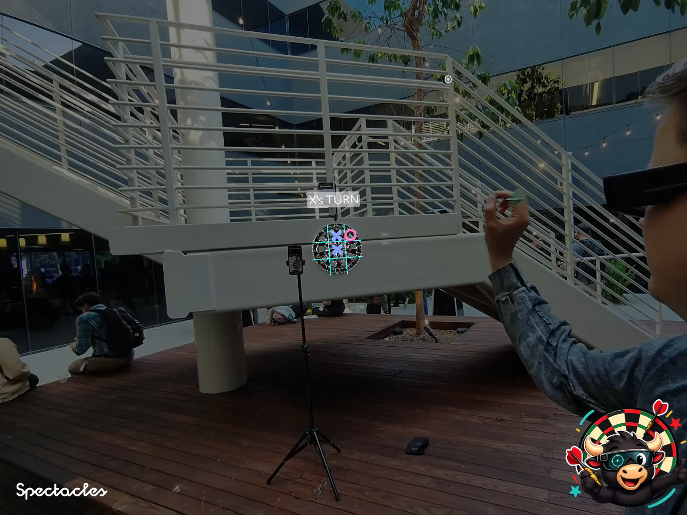
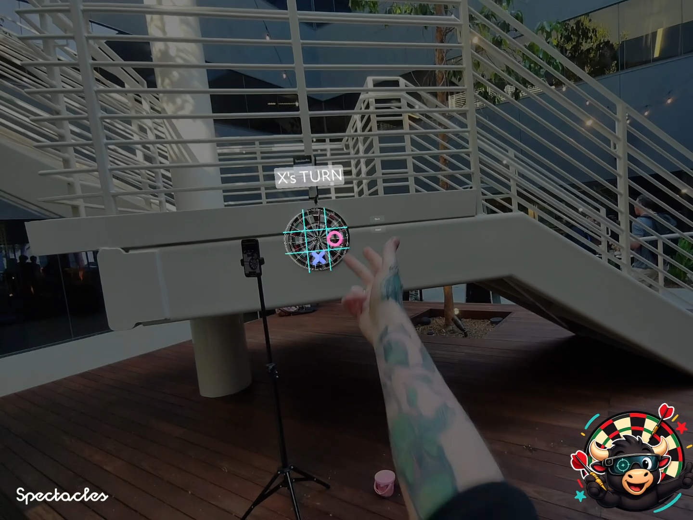
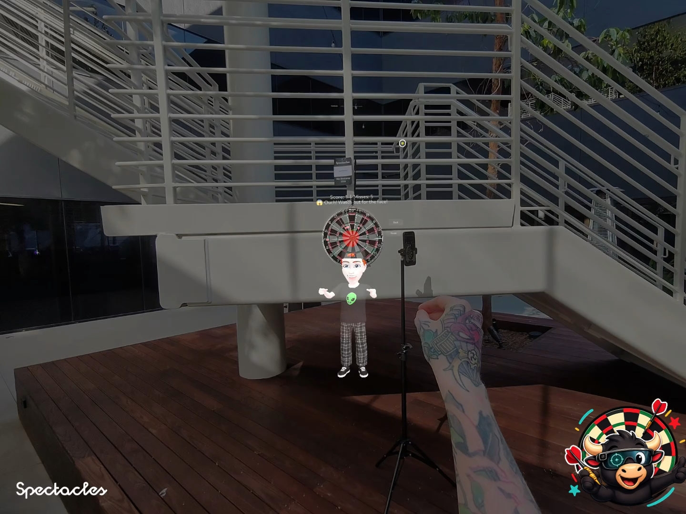
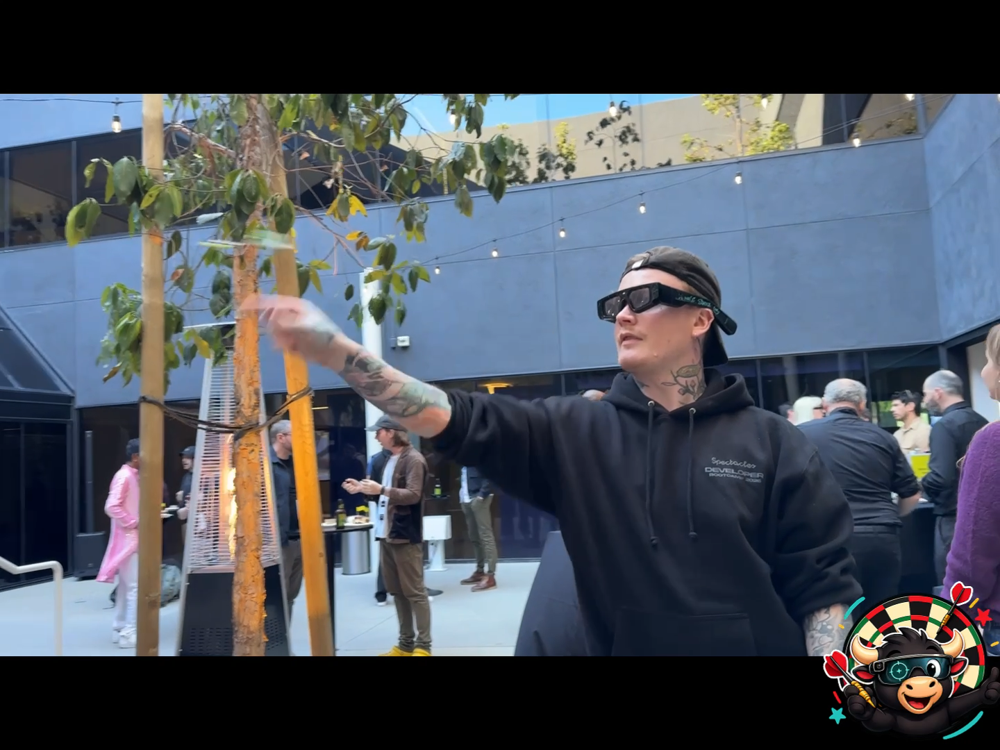
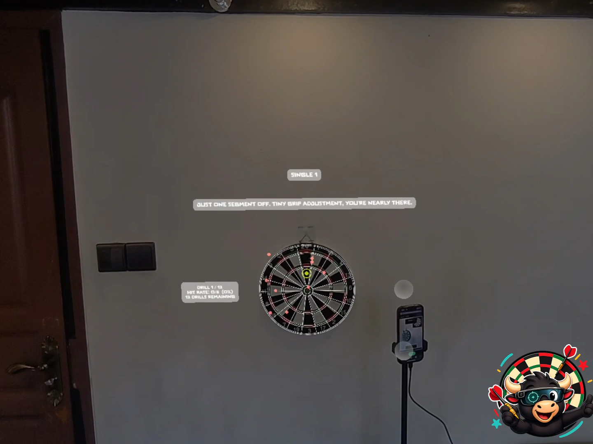
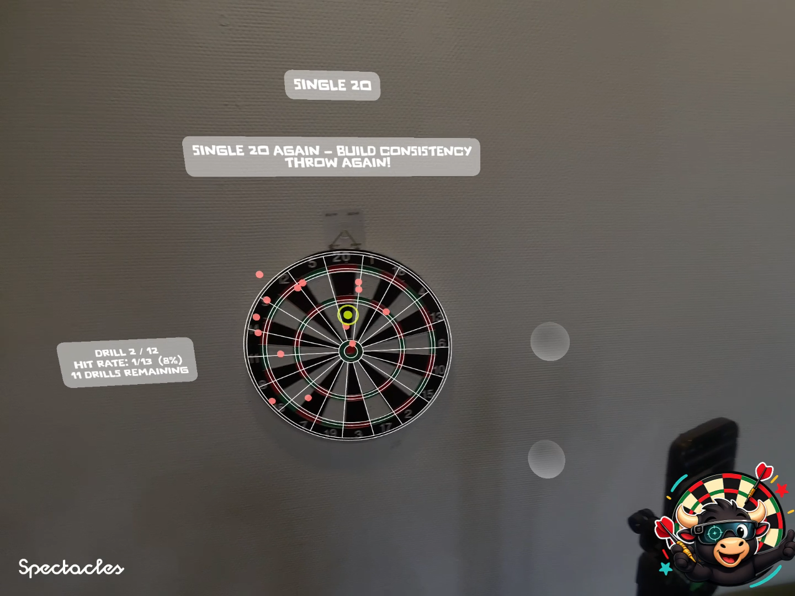
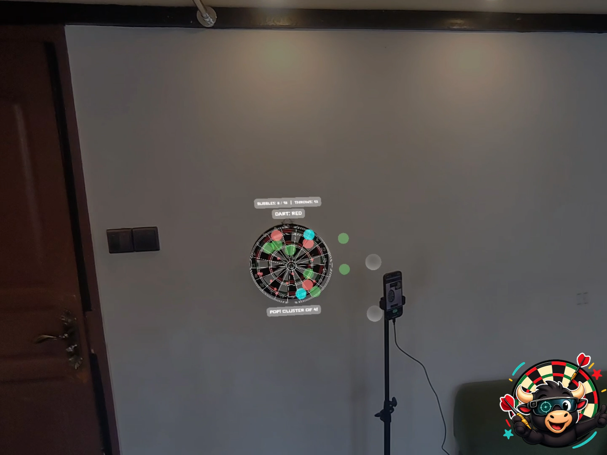
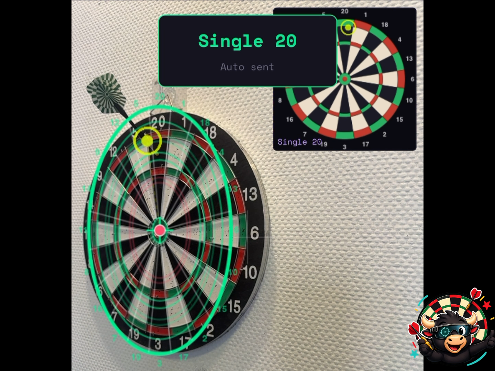
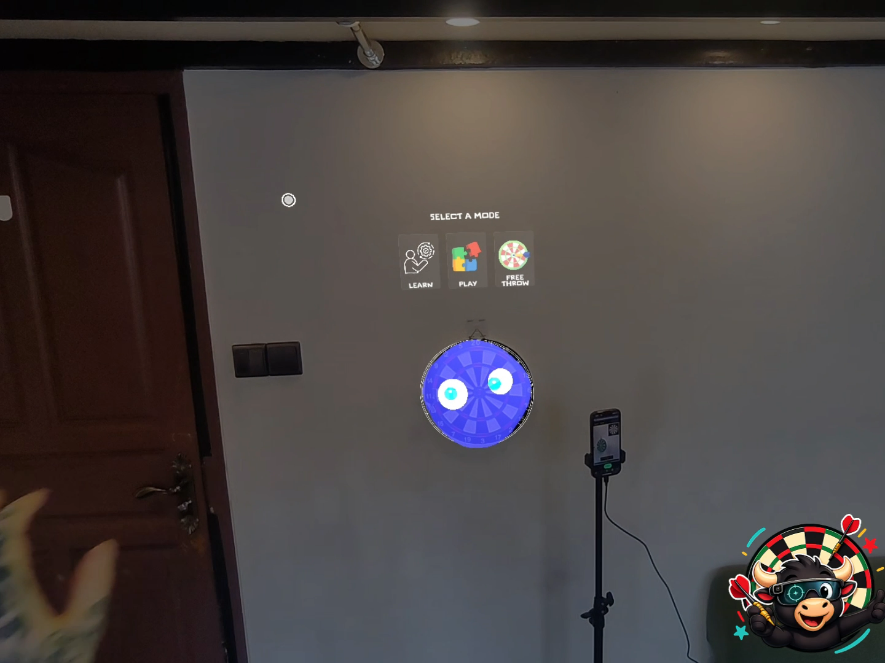

<div align="center">



# BullsAI

**Snap Spectacles that watch your darts, coach your throw, and turn any dartboard into a smart training ground with games — throw, learn, and play.**

[](https://www.youtube.com/watch?v=wr63v62yR7k)

*Built for the XRCC 2026 Hackathon — "Kill The Manual" track.*

</div>

---

## What it is

BullsAI is an AR coaching and gaming platform for darts. A phone (mounted on a tripod) watches the board through computer vision and detects every dart in real time. Snap Spectacles overlay coaching prompts, target highlights, and games onto the real dartboard.

No manual. No screen. Just throw, learn, and play.

<div align="center">

</div>

---

## Why

Anyone who's tried to learn darts knows the experience: throw a thousand darts at a wall, hope something improves. There's no instant feedback, no tracking, no progression. We've all rage-quit an IKEA manual or stared at a confusing new gadget — darts has the same problem.

BullsAI kills the manual for a hobby millions of people share. AR also opens darts to newcomers — augmenting a traditional game with social features and mini-games that attract new players.

---

## Features

- **Real-time dart detection** — phone camera + OpenCV.js, every 200ms
- **AR target highlights** — glowing zones tell you exactly where to aim
- **Coaching mode** — structured lessons on board layout, technique, and progressive drills
- **Smart feedback** — "Pulled hard right — relax your grip" or "Right number, wrong ring" based on the actual dart position
- **Four game modes** — Tic Tac Toe, Bubble Pop (Puzzle Bobble style with cluster physics), Apple on Head (William Tell), Free Throw heat map
- **Multiplayer-ready** — multiple Spectacles join the same code and see darts in sync
- **Reactive character** — slime-face mascot that responds to every throw

<div align="center">

</div>

---

## How it works

```
┌──────────────┐         ┌──────────┐         ┌──────────────┐
│  PHONE       │ ─────►  │ SUPABASE │  ◄───── │  SPECTACLES  │
│  darts.html  │ writes  │ database │  reads  │  Lens Studio │
│  + OpenCV    │         │          │         │  (TypeScript)│
└──────────────┘         └──────────┘         └──────────────┘
```

The phone is the **input device** — pure dart detector, no game logic. Spectacles is the **display** — runs all the games and coaching. Supabase is the bridge.

<div align="center">

</div>

### 4-dart calibration

Place darts at Double 20, 6, 3, and 11 (top, right, bottom, left). Four known points on a circle yield a perfect perspective transform from any camera angle. The simplest solution beat every clever auto-detection approach we tried.

---

## Game modes

### Dart Assist — coaching mode

Structured lessons on board layout, throw technique, and progressive drills. Smart feedback after every throw analyses where the dart drifted and gives technique advice.

<div align="center">

</div>

### Bubble Pop

Puzzle Bobble style cluster popper. Bubbles spawn around the rim in three colours. Hit a matching colour bubble — it and all touching same-colour bubbles fall together with explosive physics.

<div align="center">

</div>

### Apple on Head

William Tell style. A Bitmoji holds an apple — hit the apple to launch it, hit the face for a penalty.

<div align="center">

</div>

### Tic Tac Toe & Free Throw

<div align="center">


</div>

---

## Repo structure

```
BullsAI/
├── README.md
├── web/                 # Phone webapp — open on any phone in Safari/Chrome
│   ├── darts.html
│   └── assets/
└── spectacles/          # Lens Studio scripts (TypeScript)
    ├── DartBoard.ts         # Core input — polls Supabase, fires onDartLanded
    ├── BullsAILobby.ts      # Menu router (UIKit)
    ├── DartAssist.ts        # Coaching: lessons, drills, smart feedback
    ├── TicTacToeGame.ts     # Tic Tac Toe with cell takeover
    ├── BubblePopGame.ts     # Cluster bubble pop with physics
    ├── AppleOnHeadGame.ts   # William Tell apple-launch
    ├── SlimeFace.ts         # Reactive eye/face character
    └── ThrowDetector.ts     # (optional) hand-velocity throw detection
```

---

## Tech stack

- **Phone webapp** — HTML / JS / OpenCV.js
- **Spectacles** — TypeScript in Lens Studio 5
- **Sync** — Supabase (Snap Cloud) — `dart_games` + `dart_throws` tables
- **UI** — SpectaclesUIKit (RectangleButton, TextInputField), SIK (hand tracking, pinch)
- **Hosting** — phone webapp deployable as a static site (e.g. GitHub Pages)

---

## Run it locally

### Phone webapp

Live URL (GitHub Pages):
```
https://ohistudio.github.io/BullsAI/web/darts.html
```

Or run locally:
```bash
cd web
python3 -m http.server 8080
```
Then `http://localhost:8080/darts.html` in Chrome.

For mobile testing over a tunnel:
```bash
cloudflared tunnel --url http://localhost:8080
```

### Spectacles app

1. Open `spectacles/` in Lens Studio 5
2. Install **SpectaclesUIKit** and **SpectaclesInteractionKit** from the Asset Library
3. Install **SupabaseClient** package
4. Update Supabase project credentials on the `DartBoard` component
5. Send to Spectacles via File → Send To → Spectacles

---

## How to add a new game

The architecture is designed for it. Every game is a self-contained script that listens to dart events:

```typescript
import { DartBoard, DartHit } from "./DartBoard";

@component
export class MyNewGame extends BaseScriptComponent {
  @input dartBoard: DartBoard;

  private isPlaying: boolean = false;

  onAwake() {
    this.createEvent("OnStartEvent").bind(() => {
      this.dartBoard.onDartLanded((hit) => {
        if (this.isPlaying) this.handleDart(hit);
      });
    });
  }

  public start() { this.isPlaying = true; /* ... */ }
  public stop()  { this.isPlaying = false; }

  private handleDart(hit: DartHit) {
    // hit.gridX, hit.gridY (0-1 board position)
    // hit.zone ("Single 20", "Double 11", "Bullseye", etc.)
    // hit.cell (0-8 grid cell, or -1 if outside)
  }
}
```

That's it. Add a button in `BullsAILobby` and you're playing.

---

## What's next

- ElevenLabs voice coaching layer
- Form analysis using Spectacles forward camera (analyse the throw motion, not just the landing)
- LLM-powered personalized coaching that learns your weak zones
- More games — Battleships, Zombie Shooter, Around the World
- Tournament mode with proper Player 1 / Player 2 turn-locking
- Safety warning using Spectacles depth sensing

---

## Built by

[ohistudio](https://github.com/ohistudio) for **XRCC 2026** — Snap Spectacles Tech Layer × Training: Kill The Manual track.

## License

MIT — see [LICENSE](LICENSE) for details.

Mascot, custom fonts and bespoke assets in `assets/` are © ohistudio. Code is free to fork and remix.
